# IceFrame Inventory — Sistema distribuido de inventario con Laravel, PostgreSQL y Tailscale

> Aplicación web de inventario para productos tecnológicos, construida como el **Contenedor A** de un sistema distribuido. La aplicación Laravel gestiona catálogo, stock, ventas, movimientos e indicadores, mientras consume una base de datos PostgreSQL remota y se integra con un módulo de reportes externo por red privada Tailscale.

<p align="center">
  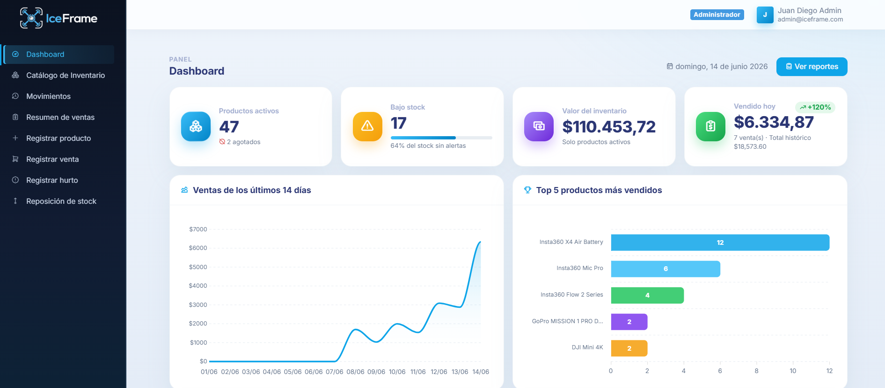
</p>

---

## Descripción

**IceFrame Inventory** es una aplicación web para administrar el inventario de una tienda de drones, cámaras de acción, cámaras 360, accesorios audiovisuales y equipos para creación de contenido. El sistema permite consultar el catálogo, registrar productos, editar información comercial, controlar stock, registrar ventas, registrar reposiciones, reportar hurtos y revisar el historial completo de movimientos.

La particularidad del proyecto es su enfoque de **sistema distribuido**: la aplicación de inventario no depende de una base local embebida, sino que se conecta a una base de datos PostgreSQL ubicada en otro contenedor o máquina dentro de una red privada **Tailscale**. Además, el dashboard puede redirigir hacia un módulo de reportes externo mediante la variable `REPORTES_URL`.

El proyecto demuestra una separación clara entre aplicación, base de datos y reportes: Laravel actúa como capa de presentación, validación y lógica de negocio; PostgreSQL conserva la persistencia compartida; y el servicio de reportes opera como componente independiente dentro de la arquitectura.

---

## Flujo del Proyecto

```text
Usuario en navegador
   ↓
Vista Blade + Tabler UI + JavaScript
   ↓
Rutas Laravel  →  Controllers
   ↓
Servicios de dominio / Eloquent Models
   ↓
Conexión PostgreSQL por IP Tailscale
   ↓
Tablas de negocio: productos · ventas · movimientos · usuarios
   ↓
Respuesta renderizada en Dashboard, Catálogo, Ventas o Movimientos
```

### Flujo distribuido

```text
Cliente web
   ↓
Contenedor A: iceframe-app  (Laravel)
   ↓
Red privada Tailscale
   ↓
Contenedor/Máquina B: PostgreSQL  (base iceframe)
   ↓
Contenedor/Máquina C: Reportes  (opcional vía REPORTES_URL)
```

---

## Stack Tecnológico

| Capa / Módulo | Tecnología |
|---------------|------------|
| Backend | PHP 8.4 · Laravel 13 |
| Frontend | Blade · Tabler UI · Bootstrap 5 · CSS personalizado |
| Interactividad | JavaScript · Tom Select · ApexCharts |
| Base de datos | PostgreSQL remoto |
| Red privada | Tailscale |
| Contenedores | Docker · Docker Compose |
| Autenticación | Guard web de Laravel usando modelo `Usuario` y tabla `usuarios` |
| Exportaciones | CSV UTF-8 con BOM · JSON pretty print |

---

## Arquitectura del Repositorio

```text
app-inventario/
├── app/
│   ├── Http/
│   │   ├── Controllers/
│   │   │   ├── Auth/LoginController.php       # Login interno contra usuarios
│   │   │   ├── DashboardController.php        # KPIs y gráficos del panel
│   │   │   ├── ProductoController.php         # Catálogo, CRUD y exportaciones
│   │   │   ├── VentaController.php            # Venta transaccional y resumen
│   │   │   ├── InventarioController.php       # Reposición y hurto
│   │   │   └── MovimientoController.php       # Historial y exportaciones
│   │   └── Middleware/
│   │       └── EnsureAdmin.php                # Acciones exclusivas de administrador
│   ├── Models/                               # Modelos Eloquent del dominio
│   └── Services/
│       └── GraficosService.php               # Datasets para ApexCharts
├── config/
│   ├── app.php                               # REPORTES_URL y configuración general
│   ├── auth.php                              # Provider usuarios
│   └── database.php                          # Conexión PostgreSQL/Tailscale
├── public/
│   ├── css/iceframe.css                      # Identidad visual azul hielo
│   ├── js/iceframe.js                        # UI, selects, modales, gráficos
│   └── images/brand/                         # Logo, icono y favicon
├── resources/views/
│   ├── auth/login.blade.php
│   ├── dashboard.blade.php
│   ├── productos/                            # Catálogo, detalle, crear, editar
│   ├── ventas/                               # Registrar venta y resumen
│   ├── movimientos/                          # Historial de movimientos
│   ├── inventario/                           # Hurto y reposición
│   ├── layouts/app.blade.php
│   └── partials/                             # Sidebar, navbar, footer
├── routes/web.php                            # Rutas protegidas y administrativas
├── Dockerfile                                # Imagen PHP/Laravel para el contenedor A
├── docker-compose.yml                        # Orquestación del contenedor de app
├── .env.example                              # Variables para DB remota y reportes
└── README.md
```

---

## Modelo de Datos

La aplicación trabaja sobre un esquema PostgreSQL preparado por el servicio de base de datos. Laravel no migra las tablas de negocio; consume el esquema existente mediante modelos Eloquent.

| Tabla | Propósito |
|------|-----------|
| `roles` | Define perfiles como Administrador y Trabajador. |
| `usuarios` | Usuarios internos que pueden iniciar sesión y operar el sistema. |
| `categorias` | Clasificación de productos: drones, cámaras, accesorios, etc. |
| `marcas` | Marcas comerciales como DJI, GoPro, Insta360 o Autel Robotics. |
| `proveedores` | Proveedores asociados a los productos. |
| `productos` | Catálogo principal con precio, condición, stock actual y stock mínimo. |
| `clientes` | Clientes registrados durante las ventas. |
| `ventas` | Cabecera de ventas completadas o anuladas. |
| `detalle_venta` | Detalle de productos vendidos, cantidad, precio histórico y subtotal. |
| `movimientos_inventario` | Bitácora de ventas, reposiciones, hurtos y ajustes. |

---

## Roles y Permisos

| Rol | Permisos principales |
|-----|----------------------|
| Administrador | Acceso completo al dashboard, catálogo, ventas, movimientos, reposición, hurto, desactivación, reactivación y eliminación segura de productos. |
| Trabajador | Consulta de inventario, registro de ventas, reposición de stock y visualización de reportes operativos. |

Las rutas sensibles están protegidas con el middleware `admin`. Por ejemplo, registrar hurtos, desactivar productos, reactivar productos y eliminar productos físicamente solo está permitido para administradores.

---

## Funcionalidades Principales

### Dashboard operativo

El panel principal resume el estado del negocio con indicadores y gráficos. Incluye productos activos, productos bajo stock, valor total de inventario, ventas del día, tendencia frente al día anterior, ventas por día, top de productos, movimientos por tipo y valor de inventario por categoría.

| Indicador | Descripción |
|----------|-------------|
| Productos activos | Total de productos habilitados en catálogo. |
| Bajo stock | Productos cuyo `stock_actual` está en o por debajo del `stock_minimo`. |
| Valor de inventario | Suma de `precio_unitario * stock_actual` para productos activos. |
| Ventas del día | Total vendido en ventas completadas del día actual. |
| Salud del stock | Porcentaje de productos activos sin alerta de bajo stock. |

### Catálogo de inventario

El catálogo permite consultar productos con filtros por producto, categoría, marca, estado de stock, orden y dirección. También permite exportar el resultado filtrado en CSV o JSON.

Estados calculados del producto:

| Estado | Regla |
|--------|-------|
| Disponible | Producto activo con stock mayor al mínimo. |
| Bajo stock | Producto activo con stock menor o igual al mínimo y mayor que cero. |
| Agotado | Producto activo con stock igual o menor que cero. |
| Desactivado | Producto oculto del catálogo regular por `activo = false`. |

### Registro y edición de productos

El formulario de productos permite registrar nombre, descripción, categoría, marca, proveedor, condición, precio, stock actual y stock mínimo. También incluye creación rápida de catálogos mediante modales para agregar marcas, categorías o proveedores sin abandonar el formulario.

### Venta transaccional

El registro de venta valida cédula, cliente, producto, cantidad y método de pago. La operación se ejecuta dentro de una transacción de base de datos:

```php
DB::transaction(function () {
    $producto = Producto::where('id', $productoId)->lockForUpdate()->first();

    // validar stock disponible
    // crear cliente si no existe
    // crear venta completada
    // crear detalle_venta
    // descontar stock
    // registrar movimiento tipo Venta
});
```

Además, el formulario incluye protección contra doble clic en frontend y una llave de idempotencia en backend para reducir el riesgo de registrar una misma venta dos veces.

### Reposición de stock

Permite sumar unidades al inventario y registrar automáticamente un movimiento tipo `Reposicion`. La observación es obligatoria para dejar trazabilidad del ingreso.

### Registro de hurto

Permite descontar unidades por pérdida o hurto. Está restringido al rol Administrador, valida que no se reste más del stock disponible y genera un movimiento tipo `Hurto`.

### Historial de movimientos

El módulo de movimientos funciona como bitácora del inventario. Permite filtrar por tipo y por rango de fechas, además de exportar los resultados en CSV o JSON.

### Resumen de ventas

El resumen permite revisar ventas completadas por periodo: día, semana, mes, año o total. También muestra totales por método de pago y permite exportar la información.

---

## Datos de Prueba y Exportaciones

Los archivos CSV y JSON generados por el sistema evidencian que las exportaciones funcionan desde los módulos principales.

| Reporte | Formatos | Datos validados |
|---------|----------|-----------------|
| Catálogo de inventario | CSV · JSON | 47 productos, 213 unidades en stock y valor total aproximado de $110,453.72. |
| Resumen de ventas | CSV · JSON | 7 ventas completadas en el periodo día, por un total de $6,334.87. |
| Movimientos de inventario | CSV · JSON | 101 movimientos registrados entre ventas, reposiciones, hurtos y ajustes. |

Distribución del catálogo exportado:

| Estado | Cantidad |
|--------|----------|
| Disponible | 30 |
| Bajo stock | 15 |
| Agotado | 2 |

---

## Rutas de la Aplicación

| Método | Ruta | Descripción |
|--------|------|-------------|
| `GET` | `/login` | Pantalla de inicio de sesión. |
| `POST` | `/login` | Validación de credenciales. |
| `POST` | `/logout` | Cierre de sesión. |
| `GET` | `/` | Redirección al dashboard. |
| `GET` | `/dashboard` | Panel principal con KPIs y gráficos. |
| `GET` | `/reportes` | Redirección al módulo externo de reportes configurado en `REPORTES_URL`. |
| `GET` | `/productos` | Catálogo de inventario con filtros. |
| `GET` | `/productos/csv` | Exportación CSV del catálogo. |
| `GET` | `/productos/json` | Exportación JSON del catálogo. |
| `GET` | `/productos/create` | Formulario de registro de producto. |
| `POST` | `/productos` | Guardar producto nuevo. |
| `GET` | `/productos/{producto}` | Detalle de producto. |
| `GET` | `/productos/{producto}/edit` | Formulario de edición. |
| `PUT/PATCH` | `/productos/{producto}` | Actualizar producto. |
| `DELETE` | `/productos/{producto}` | Desactivar producto. Solo administrador. |
| `PATCH` | `/productos/{producto}/reactivar` | Reactivar producto. Solo administrador. |
| `DELETE` | `/productos/{producto}/eliminar` | Eliminación física segura. Solo administrador. |
| `GET` | `/ventas/create` | Formulario de venta. |
| `POST` | `/ventas` | Registrar venta y descontar stock. |
| `GET` | `/ventas/resumen` | Resumen de ventas por periodo. |
| `GET` | `/ventas/resumen/csv` | Exportación CSV de ventas. |
| `GET` | `/ventas/resumen/json` | Exportación JSON de ventas. |
| `GET` | `/movimientos` | Historial de movimientos. |
| `GET` | `/movimientos/csv` | Exportación CSV de movimientos. |
| `GET` | `/movimientos/json` | Exportación JSON de movimientos. |
| `GET` | `/inventario/reposicion` | Formulario de reposición. |
| `POST` | `/inventario/reposicion` | Sumar stock y registrar movimiento. |
| `GET` | `/inventario/hurto` | Formulario de hurto. Solo administrador. |
| `POST` | `/inventario/hurto` | Descontar stock por hurto. Solo administrador. |

---

## Capturas de Pantalla

Las capturas se encuentran en:

```text
docs/screenshots/
```

### Autenticación

| Login vacío | Login con credenciales |
|-------------|------------------------|
| 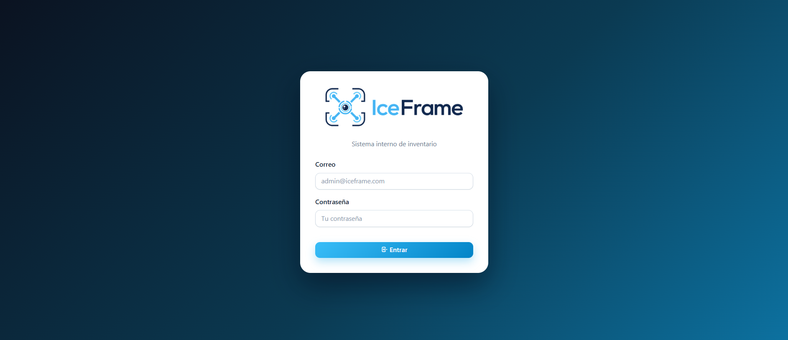 | 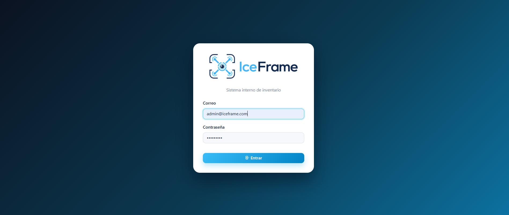 |

### Dashboard

| Dashboard - parte 1 | Dashboard - parte 2 |
|--------------------|--------------------|
|  | 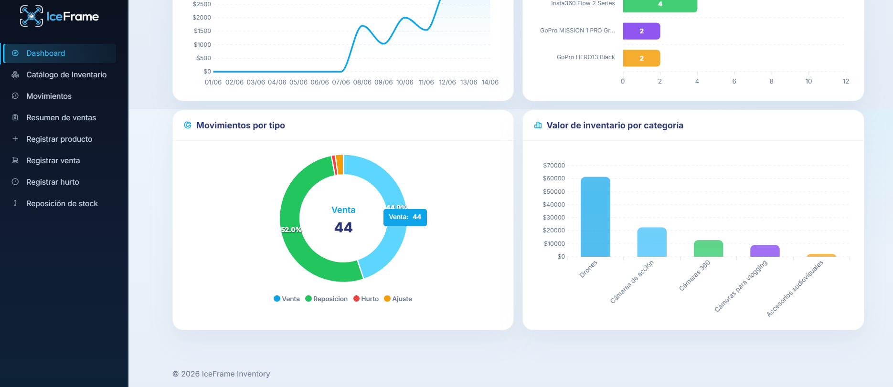 |

### Catálogo y detalle de productos

| Catálogo de inventario | Detalle de producto |
|------------------------|--------------------|
| 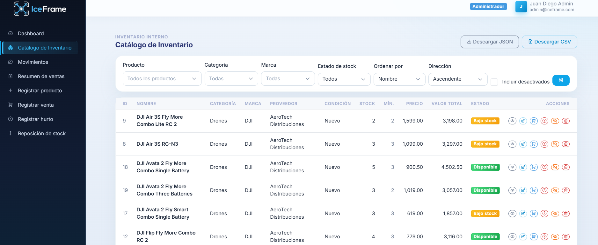 | 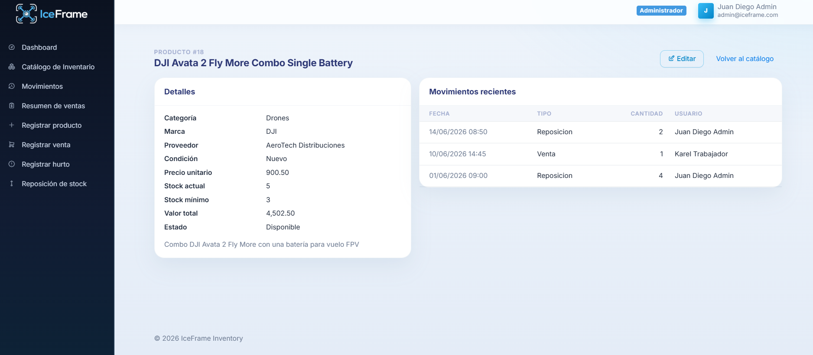 |

| Edición de producto | Confirmación de edición |
|---------------------|-------------------------|
| 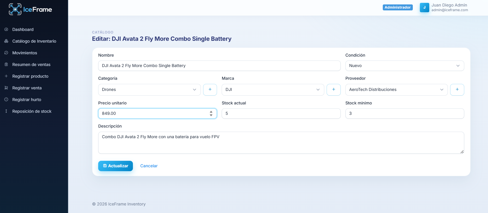 | 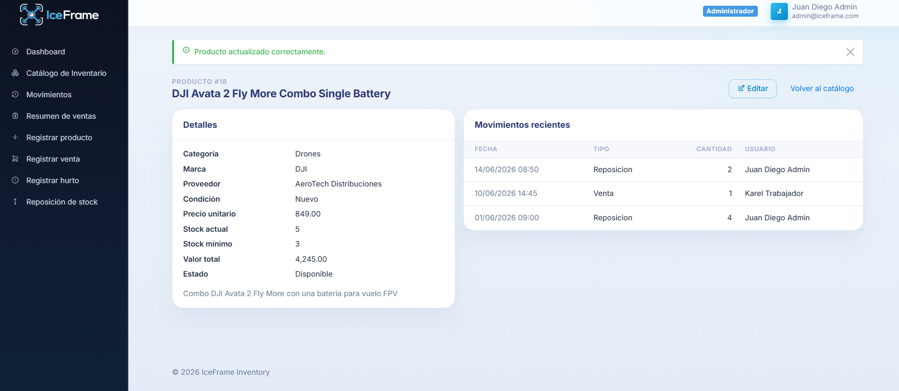 |

| Cambio reflejado en inventario |
|-------------------------------|
| 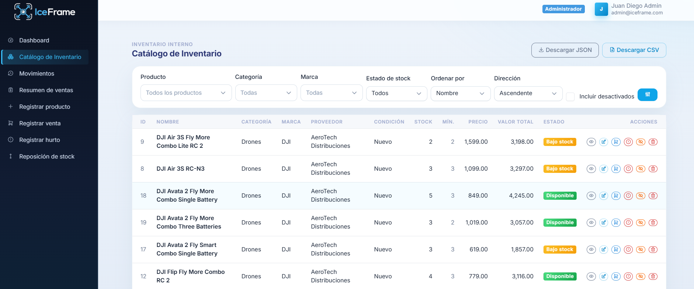 |

### Movimientos y ventas

| Historial de movimientos | Resumen de ventas |
|--------------------------|------------------|
| 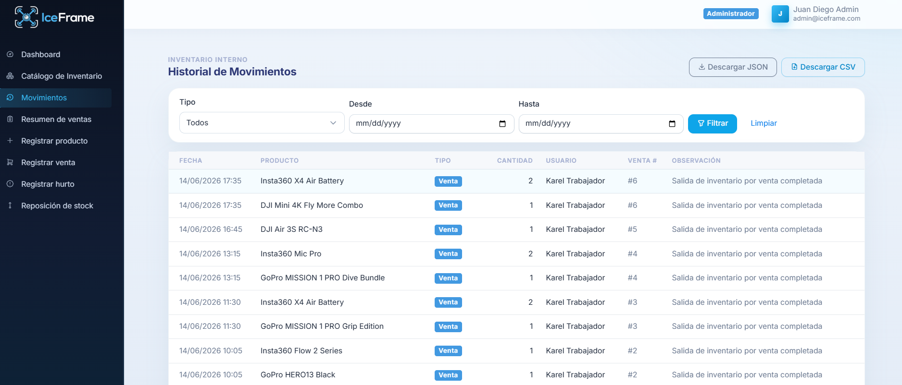 | 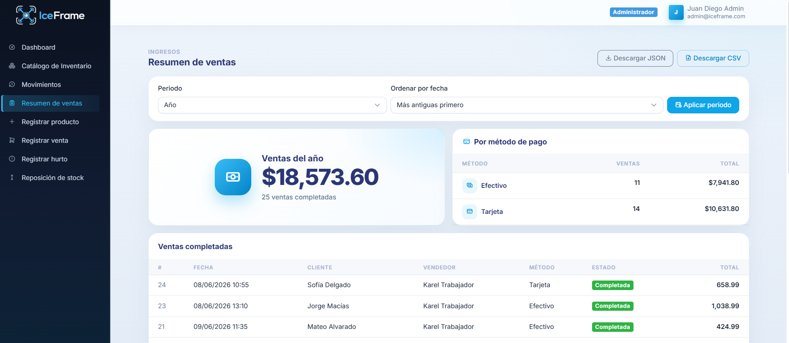 |

### Registro de producto

| Formulario | Confirmación |
|------------|--------------|
| 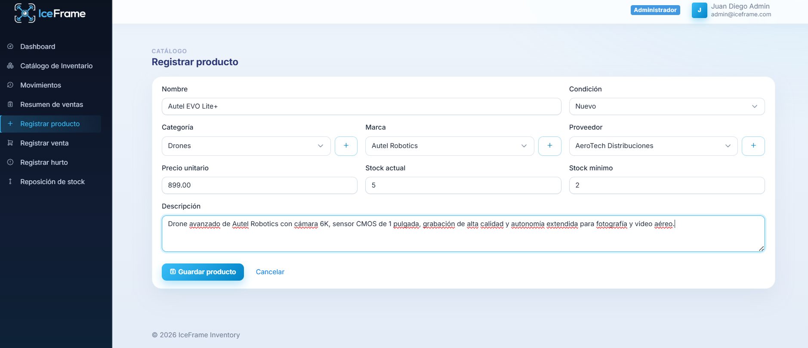 | 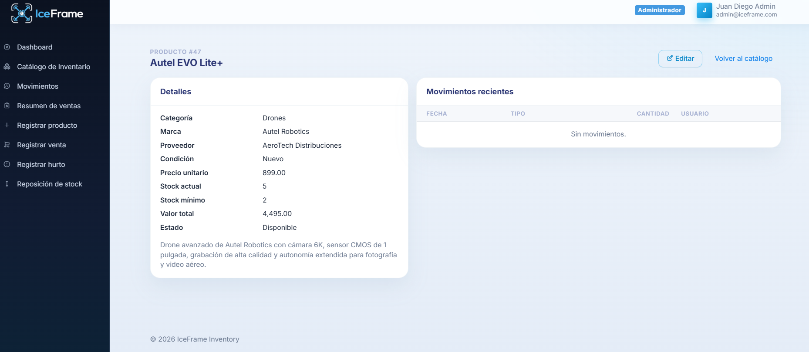 |

| Prueba en catálogo |
|--------------------|
| 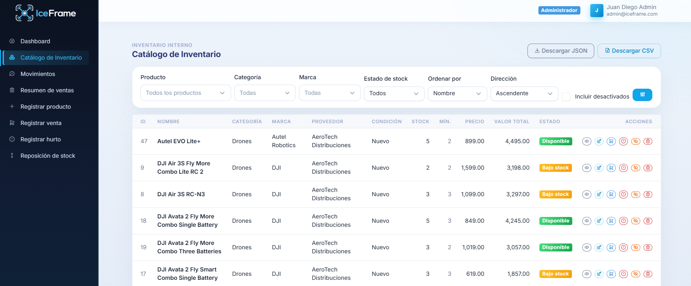 |

### Registro de venta

| Formulario | Confirmación |
|------------|--------------|
| 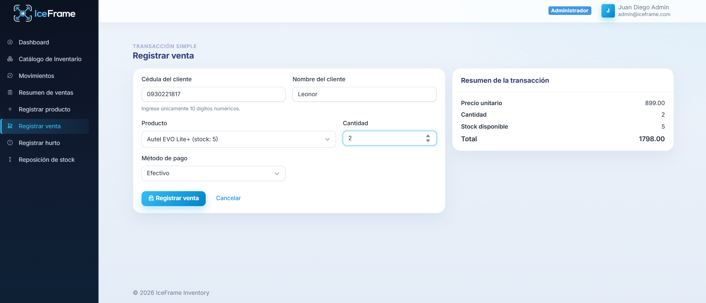 | 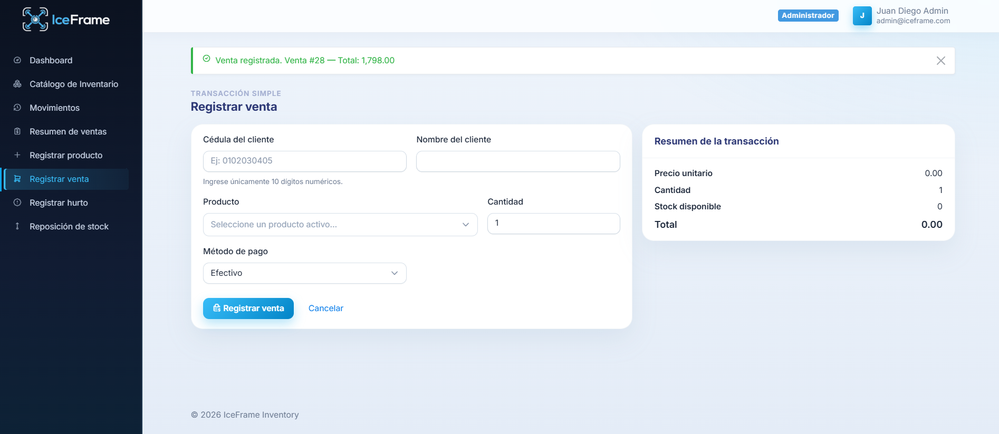 |

| Prueba en resumen de ventas |
|-----------------------------|
| 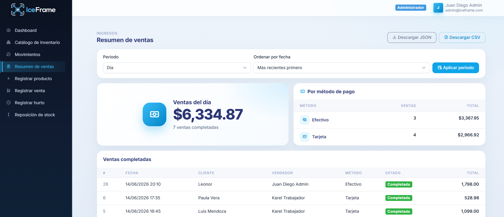 |

### Registro de hurto

| Formulario | Confirmación |
|------------|--------------|
| 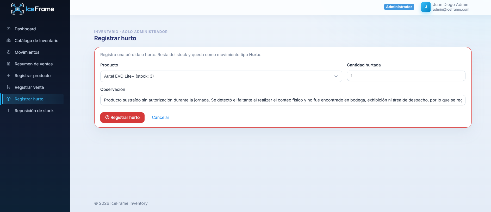 | 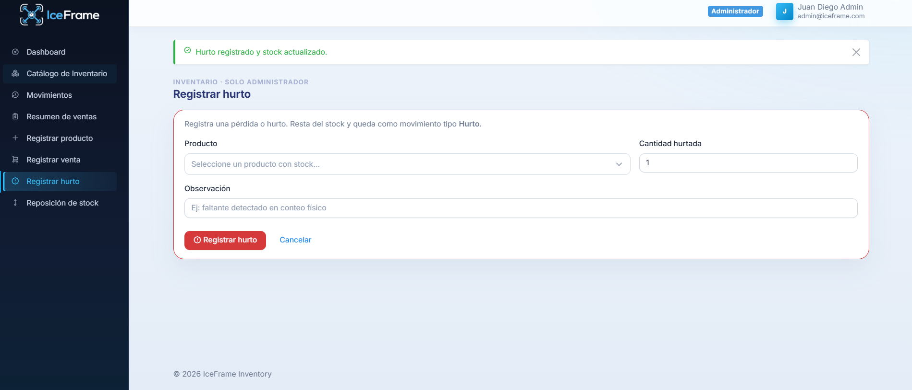 |

| Prueba en movimientos |
|-----------------------|
| 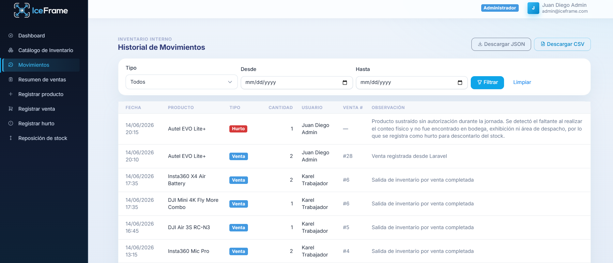 |

### Reposición de stock

| Formulario | Confirmación |
|------------|--------------|
| 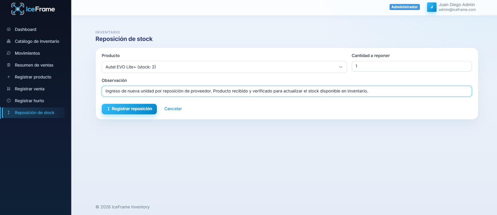 | 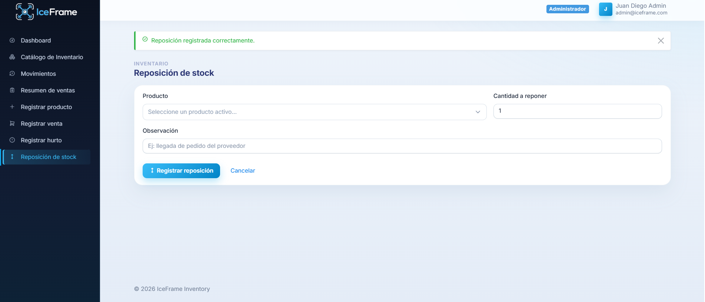 |

| Prueba en movimientos |
|-----------------------|
| 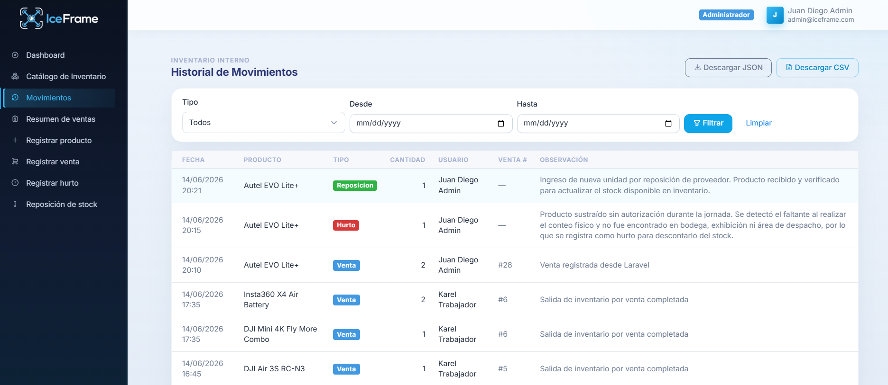 |

---

## Requisitos

### Para ejecución con Docker

- Docker Desktop o Docker Engine
- Docker Compose
- Acceso a la red Tailscale donde se encuentra PostgreSQL
- Archivo `.env` configurado con la IP y credenciales de la base remota

### Para ejecución local sin Docker

- PHP 8.4 recomendado
- Composer
- Extensiones PHP: `pdo_pgsql`, `pgsql`, `mbstring`, `bcmath`, `zip`, `openssl`, `fileinfo`
- PostgreSQL remoto disponible por Tailscale

---

## Configuración del Entorno

Crear el archivo `.env` a partir del ejemplo:

```bash
cp .env.example .env
```

Variables principales:

```env
APP_NAME=IceFrame
APP_ENV=local
APP_DEBUG=true
APP_URL=http://localhost:8000
APP_LOCALE=es
APP_TIMEZONE=America/Costa_Rica

DB_CONNECTION=pgsql
DB_HOST=IP_TAILSCALE_DE_JUAN_DIEGO
DB_PORT=5433
DB_DATABASE=iceframe
DB_USERNAME=iceframe
DB_PASSWORD=iceframe_dev
DB_PERSISTENT=true

SESSION_DRIVER=file
CACHE_STORE=file

REPORTES_URL=http://IP_TAILSCALE_DE_REPORTES:PUERTO
```

Puntos importantes:

- `DB_HOST` debe apuntar a la IP Tailscale del servidor de base de datos.
- Si la base de datos está en otra máquina, no usar `localhost`.
- `REPORTES_URL` puede quedar vacío si el módulo externo de reportes todavía no está activo.
- `SESSION_DRIVER=file` evita crear tablas de sesión dentro de la base compartida.

---

## Instalación y Ejecución con Docker

Desde la carpeta del proyecto Laravel:

```bash
cd app-inventario
```

Levantar el contenedor:

```bash
docker compose up -d --build
```

Ver logs:

```bash
docker compose logs -f
```

Abrir la aplicación:

```text
http://localhost:8000
```

Detener el contenedor:

```bash
docker compose down
```

---

## Instalación y Ejecución Local

```bash
cd app-inventario
composer install
cp .env.example .env
php artisan key:generate
php artisan config:clear
php artisan route:clear
php artisan view:clear
php artisan serve --host=0.0.0.0 --port=8000
```

La aplicación queda disponible en:

```text
http://localhost:8000
```

---

## Verificación Rápida

Antes de probar la aplicación, confirmar que la máquina está conectada a Tailscale:

```bash
tailscale status
```

Verificar que Laravel puede leer la configuración:

```bash
php artisan about
```

Probar que las rutas cargan:

```bash
php artisan route:list
```

En Docker:

```bash
docker compose ps
docker compose logs -f app
```

---

## Cómo funciona la venta en IceFrame

Cuando el usuario registra una venta, `VentaController` ejecuta una operación atómica. Primero valida los datos de entrada, luego bloquea el producto con `lockForUpdate()`, verifica stock suficiente, registra o reutiliza el cliente, crea la venta, crea el detalle, descuenta el stock y finalmente guarda un movimiento de inventario tipo `Venta`.

```text
Formulario de venta
   ↓
Validación Laravel
   ↓
DB::transaction()
   ↓
lockForUpdate() sobre producto
   ↓
Cliente + Venta + DetalleVenta
   ↓
Descuento de stock
   ↓
MovimientoInventario(tipo = Venta)
   ↓
Confirmación con total vendido
```

Este flujo evita inconsistencias de stock y mantiene trazabilidad entre ventas y movimientos.

---

## Exportaciones CSV y JSON

Los módulos principales tienen salida descargable:

| Módulo | CSV | JSON |
|--------|-----|------|
| Catálogo | `/productos/csv` | `/productos/json?descargar=1` |
| Movimientos | `/movimientos/csv` | `/movimientos/json?descargar=1` |
| Resumen de ventas | `/ventas/resumen/csv` | `/ventas/resumen/json?descargar=1` |

Las exportaciones CSV se generan con separador `;` y BOM UTF-8 para facilitar apertura en Excel. Las exportaciones JSON se generan con `JSON_PRETTY_PRINT` y `JSON_UNESCAPED_UNICODE` para que puedan leerse de forma clara.

---

## Decisiones Técnicas

- **PostgreSQL remoto**: el esquema de negocio vive fuera del contenedor de aplicación, cumpliendo el enfoque distribuido.
- **Conexión por Tailscale**: se evita exponer la base de datos públicamente.
- **Transacciones en operaciones críticas**: ventas, hurtos y reposiciones actualizan stock y registran movimientos de forma consistente.
- **Desactivación lógica**: eliminar un producto normalmente cambia `activo = false` para conservar historial.
- **Borrado físico restringido**: solo se permite si el producto no tiene ventas asociadas.
- **Middleware de administrador**: las acciones sensibles no están disponibles para trabajadores.
- **Exportaciones trazables**: catálogo, ventas y movimientos pueden descargarse en formatos abiertos.
- **Dashboard con consultas agregadas**: los gráficos se alimentan desde `GraficosService`, separando la lógica de consulta de la vista.

---

## Autoría y Distribución del Trabajo

| Integrante | Rol dentro del sistema |
|------------|------------------------|
| Karel González | Aplicación Laravel, interfaz IceFrame, catálogo, ventas, movimientos, exportaciones y conexión con servicios externos. |
| Juan Diego Sotomayor | Base de datos PostgreSQL, datos de prueba, módulo de reportes e integración por red Tailscale. |

---

## Estado del Proyecto

El proyecto cuenta con autenticación, dashboard, catálogo de inventario, detalle de producto, edición, registro de producto, venta simple, reposición, hurto, historial de movimientos, resumen de ventas, exportaciones CSV/JSON y despliegue mediante Docker Compose.

---
